# headscale-admin

headscale-admin is meant to be a simple, modern, and useful web interface for [juanfont/headscale](https://github.com/juanfont/headscale) - *"An open source, self-hosted implementation of the Tailscale control server."*

headscale-admin is still in active development and will evolve in tandem with headscale. It should not be treated as a final product, but when used properly, it should be safe to run in a production environment.

[](https://star-history.com/#goodieshq/headscale-admin&Timeline)

### Known Issues

- No known issues at this time.

### Securing headscale-admin

Please note that headscale-admin is an entirely stateless application. The static files hosted on a server do not perform any interaction with the headscale API or backend. headscale-admin only provides the application scaffolding which facilitates interactions from the client's browser to the headscale API. There are no sessions, API tokens, or any other sensitive information passed to or from the web server hosting headscale-admin. For this reason, security beyond SSL certificates is unnecessary, though you may choose to do so simply for the sake of hiding the application. Any static headscale UI offers functionality that can be trivially replicated with cURL or other web request utilities. **The security of headscale lies in your API token being securely preserved.** That said, here are some common recommendations:
- Using proper TLS (e.g. using a frontend proxy) to protect headscale-admin can successfully prevent HTML injection of the application in an active MITM attack. This is highly recommended.
- If you decide to host headscale-admin on a different subdomain than headscale, please make sure you allow your headscale-admin domain in the CORS headers of headscale to allow the requests.
- Password protection or SSO is not required to secure headscale-admin. All API key information is solely stored on your browser and is not found in cookies or session information, but you may want to obscure the fact that you have an admin utility in place just for increased anonymity. This does not prevent an attacker from using a compromised API key from interacting with your headscale API, so ensure that your keys stay protected.


### Building

headscale-admin was built using the [Skeleton](https://github.com/skeletonlabs/skeleton) framework on top of [SvelteKit](https://svelte.dev/tutorial/kit/introducing-sveltekit) + [TailwindCSS](https://tailwindcss.com/). It uses svelte/adapter-static to produce only static files when built. They can be hosted on nearly any server or environment as they are not contingent upon any specific runtime library.

#### Endpoint
**Note:** If you are building headscale-admin from source and want to host it on an endpoint other than the base of the domain, (e.g. `headscale.example.com/admin`) then you must set the `ENDPOINT` environment variable when building. Otherwise, it will default to expecting to be hosted on the root path "myheadscale.com/" and redirects and resource loading will not work correctly if you place them in a child folder. Once built, it is recommended to rename the `build` directory to the same name as your `$ENDPOINT` variable so the requests can follow the folder structure and not have to be stripped or rewritten by a front end proxy. The provided Dockerfile shows this in practice.

The default endpoint for the [headscale-admin Docker container](https://hub.docker.com/r/goodieshq/headscale-admin) is always `/admin` as this does not clash with any URL endpoints provided by the headscale API and can safely be hosted on the same subdomain.

#### Clone the repository

Clone a specific version without code history

```
git clone --depth 1 --branch <version> https://github.com/GoodiesHQ/headscale-admin
```

Alternatively, you can just clone the main branch for the latest release or `git checkout <version>` for a specific version.

```
git clone https://github.com/GoodiesHQ/headscale-admin
```

#### Set your ENDPOINT

If something other than the default '/' is desired, then set your `ENDPOINT` environment variable. The docker container uses the "/admin" endpoint by default, so that is what is shown in the examples.

Bash:

```
export ENDPOINT="/admin"
```

Cmd.exe:

```
set ENDPOINT=/admin
```

PowerShell:

```
$env:ENDPOINT=/admin
```

#### Build

You can create the production build by running:

```
npm run build
```
This will create a `build` directory that expects to be hosted at the provided `ENDPOINT` variable relative to the root domain.

#### Host Files

If you are hosting the static files locally, it is recommended that you replicate your path structure based on the `ENDPOINT` you provided. For example, if you used `ENDPOINT=/admin`, then rename the `build` directory as `admin` and place that directory in the root of your hosting. If you are hosting it on the root path (no `ENDPOINT` variable provided), then you can place the contents of the `build` directory directly into the root path.

### Build with Docker

The recommended way to deploy headscale-admin is by utilizing docker. Pre-built images are provided and always use the `/admin` endpoint by default. If you want to build an image for a different endpoint, you must use Docker build args.

Examples:
```
# Using default endpoint (/admin)
docker build . -t headscale-admin
```

```
# Use the root path (empty ENDPOINT)
docker build . -t headscale-admin --build-arg ENDPOINT=
```

```
# Using a non-default value (/manager)
docker build . -t headscale-admin --build-arg ENDPOINT=/manager
```

The image uses port 80 for hosting HTTP and it is expected that a front end proxy service will perform SSL certificate management.

```
docker run -p 8000:80 headscale-admin
```

#### Run With Docker

You can also use a pre-built image:

```
docker run -p 8000:80 goodieshq/headscale-admin:latest
```

#### Docker Versioning
Due to the dynamic nature of the headscale API, starting with version `v0.23`, headscale-admin will no longer attempt to maintain compatibility with multiple version of headscale (previously there was a *"Legacy API"* option). Instead, headscale-admin versions will track the major versions of headscale itself. This means that the tag for `goodieshq/headscale-admin:0.23` of headscale-admin will be compatible with version `headscale/headscale:0.23` of headscale. Minor versions will not track headscale as there may be a need for bugfixes outside of headscale's release schedule.

The `goodieshq/headscale-admin:latest` tag will only be used for the latest stable release of headscale-admin that is compatible with a recent stable release of headscale. Because these are not guaranteed to track, it is recommended to explicitly tag the major version of headscale that you are using.

#### Docker Compose

It is common to want to host both `headscale` and `headscale-admin` in the same docker compose configuration. My recommended method is to use Traefik which I have been running in front of headscale with no issues. This is an example deployment using [Traefik](https://doc.traefik.io/traefik/getting-started/install-traefik/), though there are many capable reverse proxies that can be utilized.

**Assumptions:**

- Host will be serving headscale and headscale-admin on `headscale.example.com`
- Your domain uses [Cloudflare](https://cloudflare.com/) for DNS (and identity verification for certificate provisioning)
- Your SSL cert resolver is called `myresolver`
- Traefik exposes ports 80 (HTTP) and 443 (HTTPS) publicly and connects to a backend network called `proxy`
- You are in the `America/Los_Angeles` time zone
- A local directory called 'conf' contains your headscale 'config.yaml'
- You are using SQLite for the headscale database.

For larger deployments, it is recommended to use [PostgreSQL](https://www.postgresql.org/). This can be done by:

- Adding a Postgres service to the docker-compose.yml file
- Created a new network called "backend"
  - Assign the postgres service to "backend" network only
  - Assign the headscale service to both "proxy" and "backend" networks to allow it to be reachable over the internet and also to reach the database without exposing the database to the public proxy network.
- Setting the Postgres settings in your config.yaml file


### Traefik Configuration

The first thing you will need is a functional Traefik installation. I am using Traefik v3.3 which is the newest version as of January, 2025. 

#### Create a `proxy` network
Create a new, external network called `proxy`. Anything on this network, even if it is in a different `docker-compose.yml` configuration file, will reachable by Traefik and can therefore be reached over the Internet based on your Traefik labels and configuration.

```
docker network create proxy
```

Next, set up a `docker-compose.yml` configuration file in a directory called `traefik` somewhere safe (e.g. `/opt/traefik`) to keep it separate from other containers or software that you may deploy.

Contents of `traefik/docker-compose.yml`:
```yaml
services:
  traefik:
    image: traefik:3.3
    container_name: traefik
    restart: unless-stopped
    command:
      - --providers.docker
      - --log.level=ERROR
      - --providers.docker=true
      - --providers.docker.exposedbydefault=false
      - --entrypoints.web.address=:80/tcp
      - --entrypoints.web.http.redirections.entrypoint.to=websecure
      - --entrypoints.web.http.redirections.entrypoint.scheme=https
      - --entrypoints.websecure.address=:443
      - --certificatesresolvers.myresolver.acme.dnschallenge=true
      - --certificatesresolvers.myresolver.acme.dnschallenge.provider=cloudflare
      - --certificatesresolvers.myresolver.acme.email=username@email.com
      - --certificatesresolvers.myresolver.acme.storage=/letsencrypt/acme.json
      - --serverstransport.insecureskipverify=true
    ports:
      - 80:80
      - 443:443
    volumes:
      - /var/run/docker.sock:/var/run/docker.sock:ro
      - letsencrypt:/letsencrypt
    networks:
      - proxy
    env_file:
	  - ./env/cloudflare.env
    labels:
      traefik.enable: "true"
      traefik.docker.network: proxy
      traefik.http.routers.traefik.tls.certresolver: myresolver
      traefik.http.routers.traefik.rule: Host(`traefik.exampe.com`)
      traefik.http.middlewares.hsts-header.headers.customResponseHeaders.Strict-Transport-Security: max-age=63072000
      traefik.http.routers.traefik.middlewares: hsts-header
      traefik.http.routers.traefik.service: api@internal
networks:
  proxy:
    external: true

volumes:
  letsencrypt: {}
```

#### Certificate Resolvers
Traefik using LetsEncrypt to automatically provision SSL certificates for your provisioned services. You may need to play with your `certresolvers` settings to get the right domain and SSL support working for you. This line in the YML file should contain the email address used for Cloudflare:
```yml
      - --certificatesresolvers.myresolver.acme.email=username@email.com
```

This example uses the Cloudflare API to perform DNS verification and requires a `./env/cloudflare.env` file (relative to `docker-compose.yml`) to contain something like:

```ini
CLOUDFLARE_DNS_API_TOKEN=<API token with DNS:Edit permission>
CLOUDFLARE_ZONE_API_TOKEN=<API token with Zone:Read permission>
```

To create the necessary API keys, go to your domain's dashboard and select **Get your API token**:

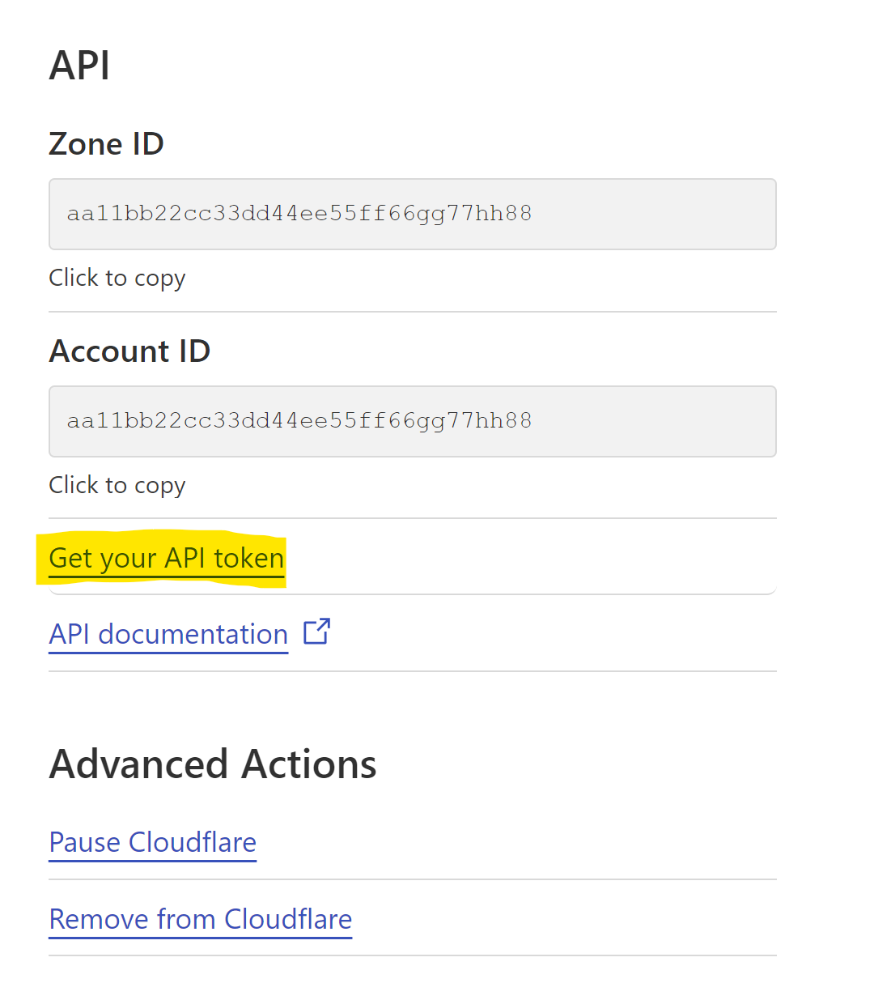

Select **Create Token** and create two new API tokens with the necessary permissions. You can use the "Edit zone DNS" template as a baseline, but you will need to modify the permissions.
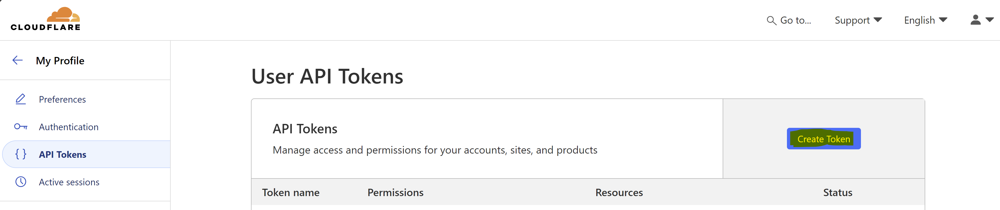

One will need **DNS:Edit**:
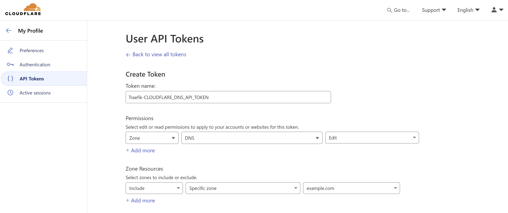

And the othr will need **Zone:Read**:
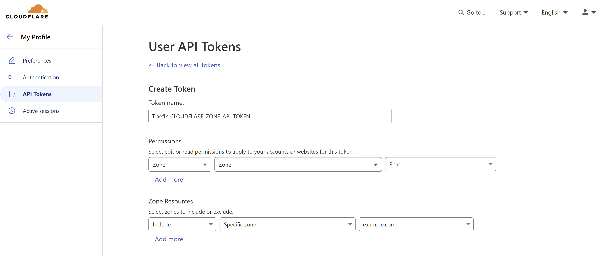

```yml
services:
  headscale:
    image: headscale/headscale:0.23
    container_name: headscale
    restart: unless-stopped
    environment:
      - TZ=America/Los_Angeles
    volumes:
      - ./conf:/etc/headscale
      - headscale-data:/var/lib/headscale
    entrypoint: headscale serve
    networks:
      - proxy
    labels:
      traefik.enable: "true"
      traefik.docker.network: "proxy"
      
      # Headscale Service Configuration
      traefik.http.services.headscale.loadbalancer.server.port: 8080
      traefik.http.services.headscale.loadbalancer.server.scheme: http
      traefik.http.routers.headscale.rule: Host(`headscale.example.com`)
      traefik.http.routers.headscale.entrypoints: websecure
      traefik.http.routers.headscale.tls.certresolver: myresolver
      traefik.http.routers.headscale.service: headscale
      
      # CORS Middleware Configuration
      traefik.http.middlewares.headscale-cors.headers.accessControlAllowMethods: "GET,POST,PUT,PATCH,DELETE,OPTIONS"
      traefik.http.middlewares.headscale-cors.headers.accessControlAllowHeaders: "Authorization,Content-Type"
      traefik.http.middlewares.headscale-cors.headers.accessControlAllowOriginList: "https://headscale.example.com"
      traefik.http.middlewares.headscale-cors.headers.accessControlMaxAge: 100
      traefik.http.middlewares.headscale-cors.headers.addVaryHeader: true
      
      # Attach Middleware to Router
      traefik.http.routers.headscale.middlewares: headscale-cors

  headscale-admin:
    image: goodieshq/headscale-admin:0.23
    container_name: headscale-admin
    restart: unless-stopped
    networks:
      - proxy
    labels:
      traefik.enable: "true"
      traefik.docker.network: "proxy"
      
      # Headscale Admin Service Configuration
      traefik.http.services.headscale-admin.loadbalancer.server.port: 80
      traefik.http.services.headscale-admin.loadbalancer.server.scheme: http
      traefik.http.routers.headscale-admin.rule: Host(`admin.example.com`) && PathPrefix(`/admin`)
      traefik.http.routers.headscale-admin.entrypoints: websecure
      traefik.http.routers.headscale-admin.tls.certresolver: myresolver

networks:
  proxy:
    external: true

volumes:
  headscale-data:
```

### Creating a headscale API Key

Your first API key must be created using the `headscale` CLI.

If you are running headscale natively, use:

```
headscale apikey create
```

I you are running headscale inside of Docker (running with container name "headscale"), use:

```
docker exec headscale headscale apikey create
```

### Home Page

A brief overview of the headscale environment with the number of users, nodes, preauth keys, and routes.


### Users Page

An overview of all headscale Users with a List or Tile layout.

- Create, Rename, and Delete Users
- Create, View, and Expire PreAuth Keys
- List User's Nodes with Online Indicators

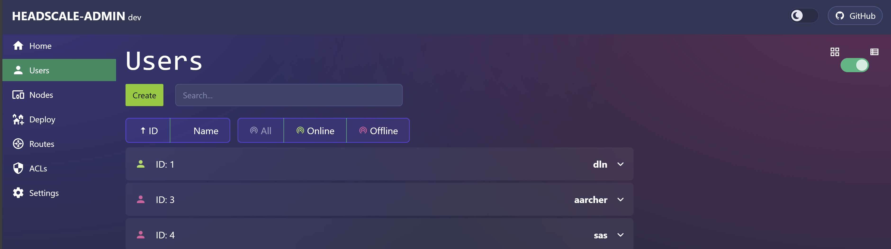

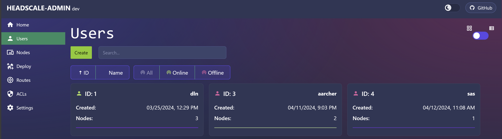


### Nodes Page

An overview of all headscale Nodes with a List or Tile layout.

- Create and Delete Nodes
- Enable/Disable Advertised Routes
- Expire a Node

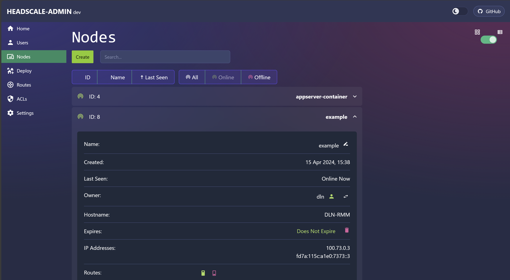

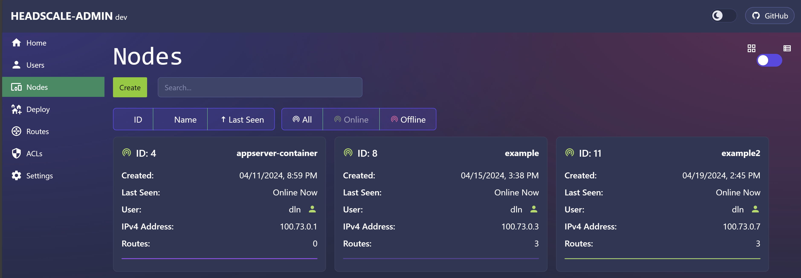

### Deploy Page

A web utility to craft a `tailscale up` command when deploying new nodes. Default deploy settings can be saved and reused for future commands.


### Routes

Display all nodes with advertised routes. Provides the ability to enable and disable routes individually, or all routes on a node.

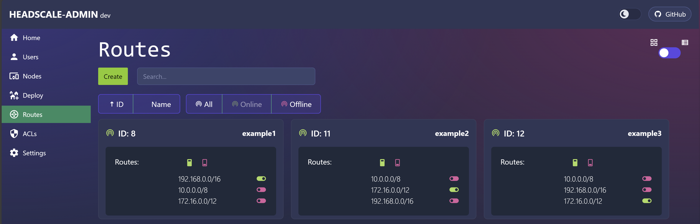

### ACL Builder

The ACL builder provides a GUI for loading, creating, modifying, and applying [headscale ACL](https://headscale.net/latest/ref/acls/) configurations.

**Note:**: For the ACL builder to be able to save the configuration, you _must_ set the ACL mode to `database` in the headscale configuration.

```yml
policy:
  mode: "database"
```

Renaming elements of an ACL should properly affect downstream elements (e.g. renaming a group should change all instances of the group name within the policies).

#### Groups
Create, modify, and rename groups of users.

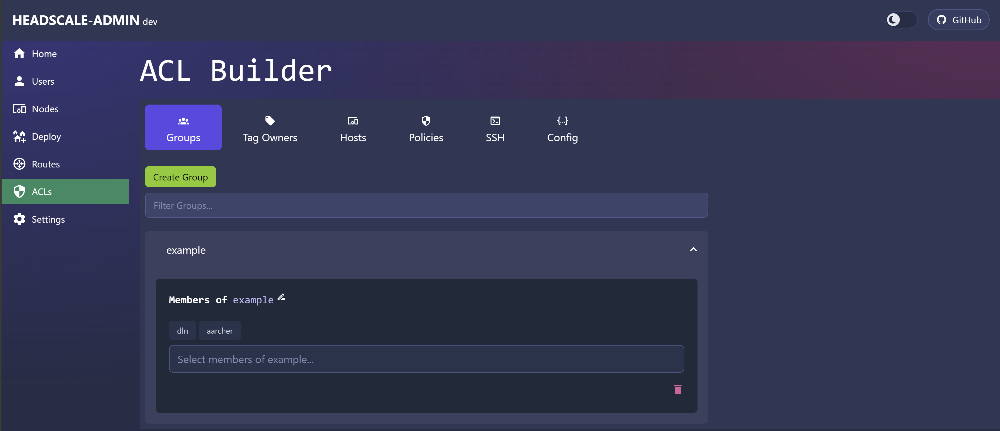

#### Tag Owners
Assign users or groups as authorized owners of headscale node tags.


#### Hosts
Create, modify, or rename hosts used in policies. Hosts can be individual IP's or networks, but must always be in CIDR format. Simply click on a host name or value to modify it after creation.

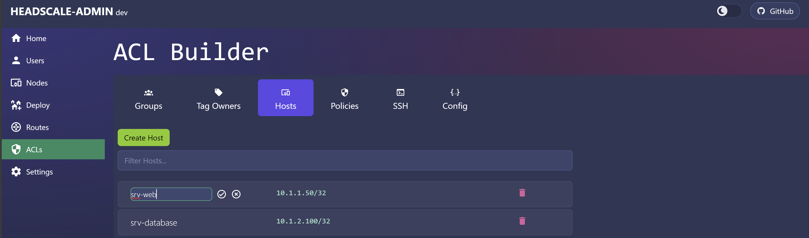

#### Policies
The policy entries allow you to create traffic restrictions based on the source and destination user, group, tag, host, or tag. These policies support ICMP, TCP, UDP, or Any protocol. Allowed values for ports are `*` or a comma-separated list of integers between 1-65535. 

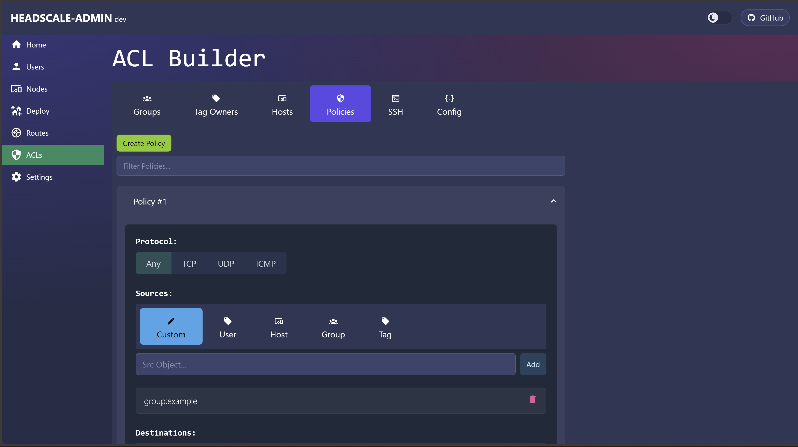

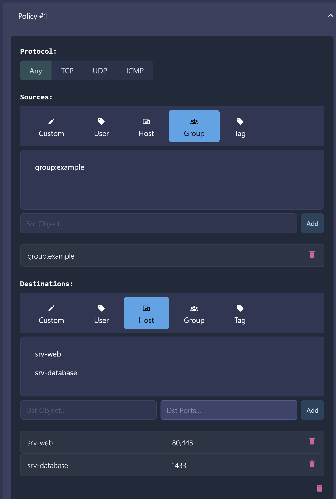

#### SSH
Create rules to permit SSH authentication using specific usernames based on the source user, group, or tag destined to a particular user or tag.

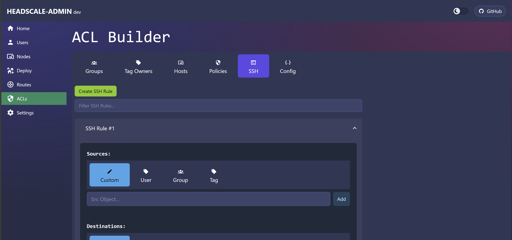

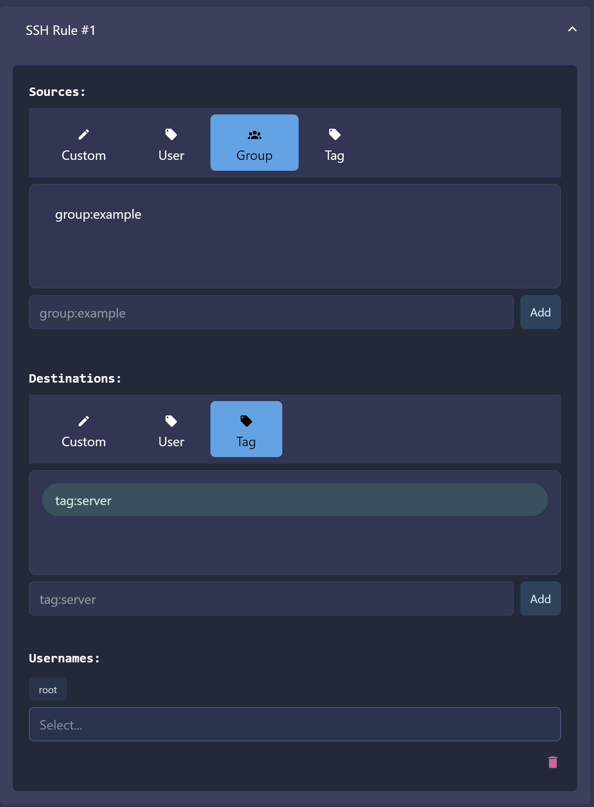

#### Config
Allows a user to save the ACL configuration to the headscale server or load a new configuration from an existing HuJSON file.

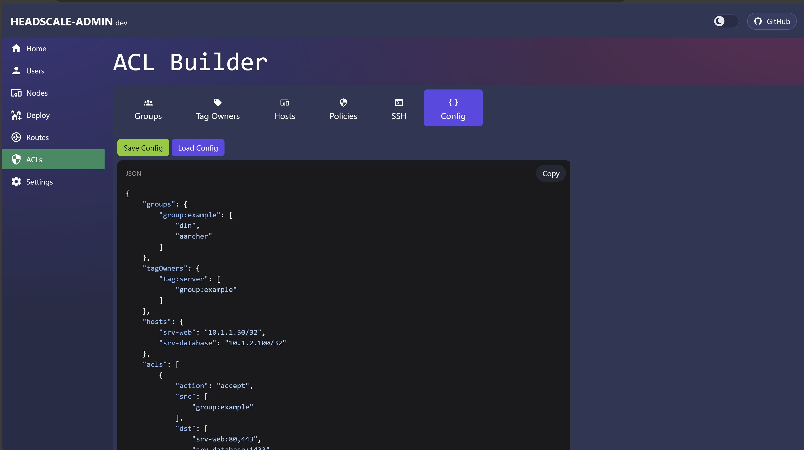

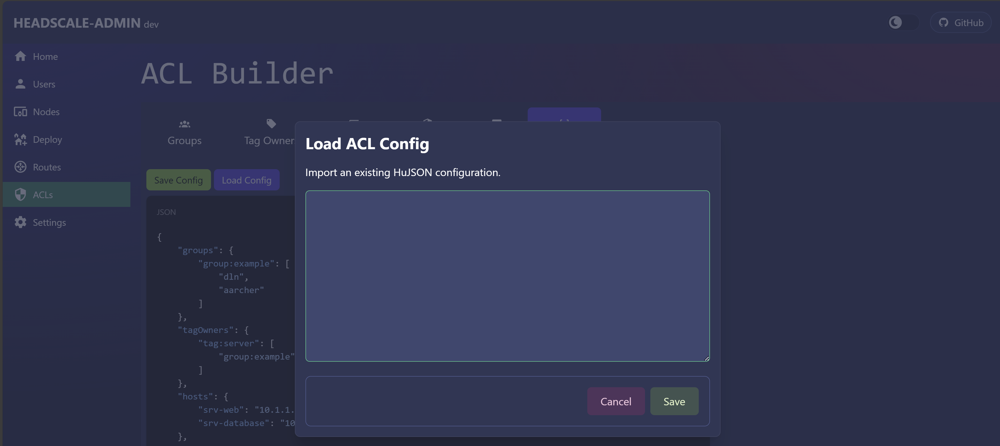

### Settings Page

Store API URL and API Key information in the browser's LocalStorage. Set API refresh interval (how frequently users, preauth keys, nodes, and routes are updated).

